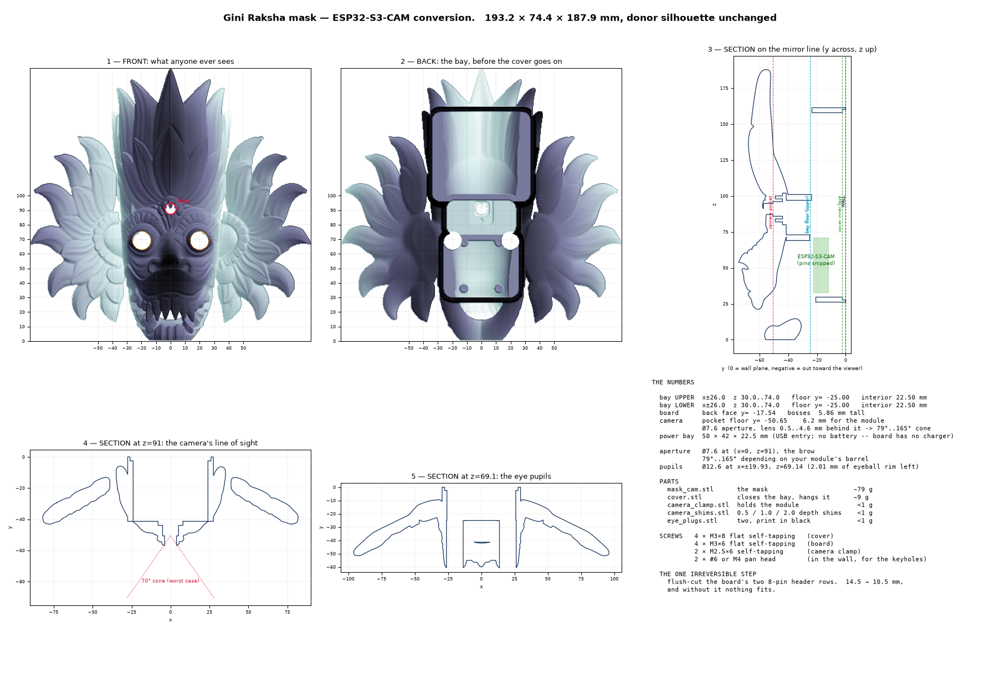

# mask-cam — a Gini Raksha mask that carries an ESP32-S3-CAM

Converts **Sri_Lankan_Mask_2.3mf** (Tbridge3D, *Sri Lankan Mask (Gini Raksha)*) into a
housing for a nulllab / emakefun **ESP32-S3-CAM**, with the lens looking out of the brow,
a 55 × 55 × 12 mm cell inside, and the electronics sealed behind a screwed cover. It
hangs on a wall or drops onto a printed stand, using the same two mounting points.

| | |
|---|---|
| **Overall** | **193.2 × 74.4 × 187.9 mm** — the donor at **1.75×**, silhouette untouched |
| **Mask** | 323.7 cm³, **~401 g** PLA, watertight, one body |
| **Aperture** | **Ø7.6 at (x 0, z 91)** — the brow, on the mirror line. **79–165°** unvignetted |
| **Battery** | **55 × 55 × 12 mm** cell in a 58 × 58 pocket, 21.2 mm of interior |
| **Parts** | `mask_cam` · `cover` · `stand` · `camera_clamp` · `battery_shim` · `camera_shims` · `eye_plugs` |
| **Nothing protrudes** | past the wall plane except the cover's own hanging pads |



---

## 1. The idea: carve the bay out of the relief, don't add a box to the back

The donor looks like a thin shell and is not. Ray-sampling it shows **8–27 mm of solid
plastic** (at 1×) over a hollow back, and the relief you actually see is only the outer
few millimetres. So the electronics bay is **milled into that thickness from behind**, and
the apertures are bored through what is left. That is why the silhouette is untouched and
the mask still hangs flat.

### Why 1.75×

The hardware does not scale. That asymmetry is the whole point: at 1× the board, the
camera and a battery were fighting over one short column; at 1.75× each gets its own place.

| | usable column | needed | verdict |
|---|---|---|---|
| 1.0× | 67 mm | 117 mm | ✗ no battery; camera trapped under the board |
| 1.5× | 118 mm | 117 mm | +1 mm — nowhere for cover screws, no home for the charger |
| **1.75×** | **154 mm** | 117 mm | **+37 mm** ✓ |
| 2.0× | 176 mm | 117 mm | +59 mm, but **621 g** |

The column is bounded below by the teeth and above by the crown, which is one continuous
piece only up to **z ≈ 164** — past that it is five separate petals (§5). 2× buys margin
you don't need for another 200 g of filament.

---

## 2. Layout

Three zones, each sized from the measured surface by `analyze_layout15.py`:

| zone | x | z | interior | holds |
|---|---|---|---|---|
| **BOARD** | ±26 | 30 – 74 | **22.50 mm** | the ESP32-S3-CAM (z 32–72) |
| **CAM** | ±24 | 73 – 97 | **35.91 mm** | camera at z 91, DWEII module (25 × 20) behind its clamp |
| **BATT** | ±34 | 96 – 158 | **21.20 mm** | the 55 × 55 × 12 cell |

**The camera is clear of the board** — z 91 against a board ending at z 72. At every
smaller scale the central column was too short and the camera had to live *underneath* the
board, meaning four screws out before you could touch it. It is now serviceable alone.

**The cell has real fixings.** At 1.5× the 58 mm pocket filled its zone edge-to-edge and
the cover's battery section was a 58 mm cantilever held by foam pressure. At 1.75× the
zone is 68 wide against a 58 pocket, so four **Ø5** posts flank the cell — ten cover screws
in total.

---

## 3. Why the brow and not the eyes

You asked for the eyes first, and the eyes are the better-looking site. They are also, by a
factor of five, the **worst optical site on the mask**, and that is measured.

The lens can only get as close to its aperture as the surrounding relief lets the module's
pocket reach. `analyze_fov.py` measured that at every candidate (1× figures):

| site | lens setback | cone at Ø7.2 |
|---|---|---|
| right eye | **11.5 mm** | **35°** |
| left eye | 12.0 mm | 33° |
| mouth | 16.0 mm | 25° |
| nostril | 1.6 mm | 133° |
| **brow** ← | **1.0–5.3 mm** | **71–151°** |

The eyeball is a solid hemisphere boss with thick relief all round it; the brow is a thin
skin over the deep central cavity. A central bore on a Raksha mask reads as an **urna /
third eye** — an authentic motif rather than damage.

### What the lens actually gets

⚠️ **Correcting an earlier claim.** This section used to say the setback was "set to
3.0 mm, giving a 103° cone". `LENS_SETBACK = 3.0` was a stated intent that the geometry
never implemented — the pocket floor is derived from the *relief limit*, not from that
parameter, so the number was dead and the 103° was wrong.

With the module now measured at **6.20 mm** front-of-lens to back (2026-08-18), here is
what it really gets:

| module sits | setback | unvignetted cone |
|---|---|---|
| face flat on the pocket floor, nothing in the bore | 4.59 mm | **79°** |
| barrel nosed the full 4.6 mm up the Ø7.6 bore | 0.50 mm | **165°** |

The geometry assumes the **pessimistic** end: the pocket floor sits at the relief limit
(53.15 mm proud, cut to 50.65, leaving exactly the 2.50 mm wall), and nothing is assumed
to enter the bore. Any real barrel protrusion only moves the lens closer to the aperture,
which widens the view — it can never make it worse.

**79° is the number that matters, and it is comfortably enough.** A stock OV2640 lens is
65–70°, so even at the pessimistic end the aperture never crops the sensor's image. The
glass also sits 4.6 mm down a dark tunnel, so no lens is visible from the front.

Both eyeballs get **Ø12.6** bores and printed blanking plugs — the symmetry is what makes
the brow bore read as ornament. The aperture itself is **not** scaled: it only has to pass
the real Ø7.0 lens, so on the bigger mask it is proportionally smaller and harder to spot.

---

## 4. Where every number came from

The honest ledger. ⚠ rows are the ones that move plastic.

### Measured off the donor mesh (0.5 mm ray grid, re-run on every build)

| what | value | how |
|---|---|---|
| bounding box | 193.2 × 74.4 × 187.9 | trimesh, watertight |
| **eyeball centres** | **x = ±19.9, z = 69.1** | peak stand-off in the eye band, centroid-fitted |
| crown continuity | one piece to **z ≈ 164** | connected-component scan per z row |
| BOARD zone | 39.60 mm worst stand-off | rectangle minimum over x±26, z 30–74 |
| CAM zone | 41.41 mm | over x±24, z 73–97 |
| BATT zone | 26.70 mm | over x±34, z 96–158 |

> **The eyeball detection is self-checking.** The two caps come out symmetric to **0.14 mm
> in x and 0.00 mm in z**. A detector locking onto noise does not do that — an earlier
> version whose search band was left in *unscaled* coordinates landed on the **nostrils**
> and returned 3.5 mm caps instead of 7 mm. If you change `MASK_SCALE`, check that
> agreement before trusting the result.

### From the vendor's KiCad STEP (via `../sonos-nest/hardware/cam-button`)

| what | value |
|---|---|
| PCB | 30.4 × 38.4 × 1.60 (40.0 overall with the USB-C shell) |
| mounting holes | Ø3.20 on 24 × 32, Ø6.40 keep-out — **M3, not M2**. ✅ Confirmed by a 40.00 mm measured diagonal |
| tallest top-side part | 4.96 (USB-C shell) from the PCB **back** face |

### Measured on the board in hand (V1.1, 2026-08-18)

| what | value | consequence |
|---|---|---|
| header rows | **bare plated holes** | nothing to snip — the old "flush-cut the pins" step is void |
| J1 / J2 | **unpopulated footprints** | the back face is flat |
| total thickness | **7.50 mm** with power wires on | `REAR_PROTRUSION` = 2.54 |
| **camera module** | **6.20 mm** lens front → back | supersedes the 5.0 + 2.0 estimate; pocket offers 6.70 |
| VBAT with USB connected | **0 V** | **there is no charger on this board** (§7) |

### Derived, never typed

```
FLOOR_Y_*    = -(min stand-off over the zone - FRONT_WALL)
BOARD_SEAT_Y = FLOOR_Y_UP + BOARD_FRONT_CLR + COMP_Z_MAX - PCB_T
CAM_SEAT_Y   = CAM_POCKET_Y + CAM_MODULE_DEPTH + 0.5
```

Change `MASK_SCALE`, `FRONT_WALL` or a zone outline and everything downstream moves with
it. There is no second number to forget.

---

## 5. The checks, and what they caught

`build_mask.py` runs **55 clearance checks before it will build**; `verify.py` re-measures
the **exported STL** afterwards with **16 more**. Between them they caught six real
defects:

- **The bay floors.** A hand-made sampling table said they were fine; the true rectangle
  minima would have broken through the relief by 0.68 mm.
- **Every boss and post was floating.** The bay floor is a *plane* at the zone's worst
  case; the donor's back is a *dish*, already deeper than that plane almost everywhere, so
  pillars based on it stood in 2.5–7.6 mm of nothing. Each is now rooted on its own local
  rear surface.
- **Board bosses were 1.6 mm too tall** — they topped out at the PCB's *back* face when the
  board seats on its *front*, inside the Ø6.4 keep-out ring. Exactly `PCB_T` of error.
- **The battery zone severed the crown.** Reaching past z ≈ 164 put its top wall across
  five separate petals, and because the wall sits behind their rear surfaces it never
  merged — the mesh came apart into four bodies. Petals are not structural ground.
- **The USB-C port cut sat at floor depth** instead of on the receptacle's midline, eating
  forward into the muzzle and leaving 1.28 mm of relief.
- **The camera clamp was cut to a seat that does not exist.** `CAM_SEAT_Z1` asks for
  z = 102, but the battery zone's floor crosses the waist at z = 97 and sits 20 mm
  *behind* the seat, so the last 5 mm of it is a sealed void inside solid plastic — and
  the second clamp pilot went into that void. The clamp came out 21.5 mm long for a
  17.0 mm recess and had one of its two screw holes over nothing. Every dimensional check
  passed: they all asked the *parameters* whether the seat was 22 mm long, and none asked
  the *mesh*. `verify_smalls.py` now places both small parts in the mask mesh and fails on
  any overlap, and `build_mask.py` asserts that no seat outruns its own zone and no pilot
  lands where a screwdriver cannot reach.
- **The keyholes were inverted** — entry circle above, capturing slot below. Every
  dimensional check passed, because none of them asked which way up it was; the mask would
  simply have slid off the screws. `verify_cover.py` now asserts the entry sits *below* the
  resting position, and probes the mesh for solid material above the shank.
- **Extending the bay downward filled a tooth gap.** A wider lower bay put its wall through
  the mask's teeth; `verify.py` caught it closing one. Face area in the muzzle is paid for
  out of the mouth.

It also caught **three bugs in itself**, worth recording because a checker that measures
the wrong thing is worse than none:

- `cast()` returns crossings **rear-first**, but the relief check took `ys[0] - ys[1]` —
  the *rearmost* solid span. At the failing point the spans were 1.28 / 14.32 / **8.12**
  and the relief was the 8.12. It now sums solid material **forward of the bay floor**,
  ignoring sub-0.15 mm tessellation slivers (reported, not hidden).
- Volume bounds, sample points and the eye search band were all hardcoded at 1×.
- A 1e-6 mm tolerance flagged manifold's own floating-point noise as a geometry change.

Current result on the exported mesh:

```
relief in front of the bay >= FRONT_WALL   thinnest 8.40 mm  (design min 3.00)
camera pocket relief >= CAM_WALL           thinnest 2.46 mm  (design min 2.50)
board envelope unobstructed                0 obstructed samples
front surface identical off-bay            7 scaled sample points
bounding box == donor's                    [193.24, 74.35, 187.91]
```

---

## 6. Parts

| file | size | mass | notes |
|---|---|---|---|
| `mask_cam.stl` | 193.2 × 74.4 × 187.9 | ~401 g | the long print |
| `cover.stl` | 71.5 × 130.3 × 7.5 | ~26 g | 3 walls, 25 % infill; **vented** (§7) |
| `stand.stl` | 181.6 × 99.7 × 137.4 | ~151 g | optional, for a mantel |
| `camera_clamp.stl` | 15.6 × 16.6 × 3.2 | ~1 g | **one** M2.5, cut to the seat that is really in the mask — see §6.1 |
| `battery_shim.stl` | 62 × 56 × 13.2 | ~10 g | fills the 9.20 mm between the cell and the cover, and locates the cell |
| `camera_shims.stl` | 3 shims, 0.5 / 1.0 / 2.0 | <1 g | take up the 0.50 mm of slack behind the module |
| `eye_plugs.stl` | 2 plugs, Ø12.45 | ~2 g | print in black |

---

## 7. Power — and why the cell needs the DWEII module

**Measured, not assumed: the cam board has no charger.** With USB connected and no cell
fitted, the VBAT pad reads **0 V** — nothing drives it. The 0 V is also good news about the
power MUX: had the P-FET been reversed, its body diode would have put ~4.1 V there and
pushed uncontrolled current into any cell. It doesn't.

So charging happens on a **DWEII Type-C boost + charge + protect module** — **25 × 20 mm**,
5 V 2 A out, 2.4 A charge, and it **charges and discharges simultaneously**, which is what
makes it a UPS rather than a swap-the-cell arrangement. One board replaces a passive
breakout *and* a separate charger:

```
USB-C cable ──► DWEII  Type-C socket        (charges the cell)
                       + / −  pads  ──► cell
                       5V     pads  ──► cam board J4 pin 1 (`5V`) + pin 2 (`GND`)
```

Nothing depends on the cam board's own power path. It lives in the **CAM waist**, which has
38 mm of interior and only ~10 of it used by the camera clamp.

### Finding the pads

On the cam board's back, top row, reading left → right:
`0` `14` `47` `NC` `48` `1` `GND` `5V` — the square pad is `5V`, pin 1.

⚠️ The pad marked **`1` is GPIO1, not a power pin.** It is two along from `5V` and is the
easy one to hit by mistake.

---

### Cooling

The bay is otherwise sealed and MJPEG streaming runs the S3 hard, so the cover carries
**nine 26 × 2.6 mm vent slots — 595 mm², 6.4 % of its plan area.** They face the wall, so
they cost nothing visually; this is the one surface where venting is free.

They are placed as a **chimney, not as decoration**: an intake bank below the board
(z 33–39) and an exhaust bank above it (z 65.5–72.5), 57 mm apart, so convection has
somewhere to go once the mask hangs vertically. A third bank over the waist (z 82–90)
serves the DWEII boost converter, which dissipates at 2 A.

**Nothing is vented over the cell.** Warm air drawn across a LiPo is the opposite of what
you want, and heat is what ages a pouch fastest. `verify_cover.py` asserts the cell band
(z 98–156) stays solid, that every slot clears all ten countersinks and both hanging pads,
and that the slots stay inside the x = ±21 post columns so the plate's load paths are
untouched.

> ⚠️ **Vents leak light both ways.** The board's power LED and its GPIO3 flashlight LEDs
> will be faintly visible around the mask's edge in a dark room. If that matters, mask
> them off or drive GPIO3 low.

---

## 8. Assembly

**Order matters** — the camera and the cell go in before the board is bolted down.

1. **Solder two wires to the cam board** while it is out and both faces are reachable. Feed
   them from the **back** so they exit toward the cover; the space in front of the board is
   the ribbon plenum.
2. **Camera module** into the pocket at (0, 91), lens forward into the Ø7.6 bore. Push it
   as far forward as it will go — every millimetre the barrel enters the bore widens the
   view (§3).
3. **`camera_clamp.stl`** over it, **one** M2.5 × 6 into the pilot at z = 83 — the only one
   there is (§6.1). Feed the ribbon **up through the slot in the clamp itself** — it runs
   on the mirror line from below the pocket's lower lip to the top of the pressure rib —
   and lay it over the clamp *before* you fit the screw. The clamp's top face finishes
   flush with the waist floor and every edge the ribbon crosses is chamfered, so nothing
   is pinched and nothing is creased. The pocket offers
   **6.70 mm** against the module's measured **6.20**; the clamp's U-rib takes up 0.65 of
   that, and a 0.5 mm shim behind the module takes up the rest if yours sits low.
4. **Fold the excess ribbon** into the plenum. The module ships on a **75 mm** FPC against a
   much shorter path, and it cannot be trimmed — the gold fingers are the termination.
   S-fold it; don't crease it.
5. **DWEII module** (25 × 20 mm) into the waist behind the clamp, its 25 mm axis across
   the mask — the 20 mm axis has only 1 mm of clearance in z and the long one will not go.
   Wire its `5V` output pads to J4 `5V`/`GND`, and its `+`/`−` pads to the cell. Its own
   Type-C socket takes the incoming cable; there is no USB-A on it.
6. **Cell** into the battery zone, then **`battery_shim.stl`** on top of it, ribs facing the
   cell's back and the two tall walls straddling it. It fills the 9.20 mm that would
   otherwise let the cell move, and holds it in x, which is the axis with 4.7 mm of slop.
   Feed the tabs out through either wire gate. **Do not glue the cell** — LiPo pouches
   swell with age and a glued-in cell is a dead mask, which is the whole reason the shim
   is a separate printed part rather than a blob of epoxy.
7. **Board** onto the four bosses, component side **facing forward**, USB-C pointing
   **down**, 4 × M3 × 6 flat self-tapping.
8. **Eye plugs**, pushed in from the front with tweezers.
9. **Cover**, 10 × M3 × 8 flat self-tapping. Countersinks face the wall and must sit flush;
   a proud head rocks the mask.
10. **Hang it** — two #6 or M4 pan-head screws **38.5 mm apart**, or drop it on the stand.
    The keyholes take the head through the **lower, round** end and capture the shank at
    the **upper, narrow** end: offer the mask up, engage both heads, then let it drop 5 mm.

### Screws

| where | qty | screw |
|---|---|---|
| cover → posts | 10 | M3 × 8 flat, self-tapping |
| board → bosses | 4 | M3 × 6 flat, self-tapping |
| camera clamp | 1 | M2.5 × 6 self-tapping |
| wall (or the stand's pegs) | 2 | #6 or M4 pan head |

All thread-forming into bare printed plastic — no nuts, no heat-set inserts.

---

## 9. The stand

`stand.stl` carries two mushroom pegs on the **mask's own keyhole spacing**, so the mask
drops onto it exactly as onto wall screws. One interface, two uses, and no change to the
mask.

**18° lean, from measurement.** The mask's centre of mass sits **34.2 mm forward** of its
back plane and 84.4 mm up, so upright it tips forward. Leaning back moves that overhang
toward the pivot — `34.2·cos θ − 84.4·sin θ` — reaching zero at ~22°. At 18° the mask
overhangs by 6.49 mm, killed by a base reaching 60 mm forward. Mask and stand together put
the combined CoM **7.24 mm** forward with **52.8 mm** of base ahead of it.

A **14 × 8 mm cable channel** runs out the back of the base, with a notch through the panel
foot so the cable can turn into it — sized for a USB-C overmold, not the bare cable.

| assembled | |
|---|---|
| on the stand | 193 W × 100 D mm — needs **100 mm of shelf depth** |
| on a wall | 193 × 188 mm, standing 5.0 mm proud |

---

## 10. Print

| part | orientation | supports |
|---|---|---|
| **mask_cam** | upright, as the donor's own plate has it | yes — as the donor already needs |
| **cover** | **inner face down** | none |
| **stand** | **flat on its back panel** | none |
| **camera_clamp** | **top face down** — as exported | none |
| **battery_shim** | **face plate down** — as exported | none |
| **shims / plugs** | flat | none |

- The mask keeps the designer's orientation because that is what the relief was drawn for.
  Everything added runs **parallel to Y**, horizontal in that orientation, so the bay walls,
  floors and every bore are vertical-walled features rather than bridges.
- **Cover inner face down** puts the wall-facing side — the one that must stay flat — on the
  bed, and opens the countersinks and the keyhole undercut upward.
- **Stand flat on its back panel** faces every overhang up.
- **Clamp top face down** makes the countersink a self-supporting cone and leaves the
  pressure rib as the last thing laid down. **Shim face plate down** puts the face that
  meets the cover on the bed and stands every rib up off it. Both are exported already
  rotated — drop them on the plate and do not re-orient them.
- PLA or PETG, 0.2 mm layers. The donor's profile (2 walls, 5 % infill) suits the mask. Give
  the **cover 3 walls / 25 % infill** — it carries the mask's weight through its screws —
  and the **stand 3 walls / 25 %**, since it carries the whole 403 g.
- Print the mask **dark** if you can. The apertures read as shadow; a Ø7.6 hole in pale
  filament is a Ø7.6 hole.

Everything is verified before the print starts — `build_all.py` refuses to write an STL
that fails a check.

---

## 11. Still open

1. ~~The DWEII module.~~ ✅ **Verified from the manufacturer's dimension drawing: 25 × 20 mm**
   (3 mm wider and 2 mm shorter than the guess it replaced — the waist grew from 22 to
   24 mm in z to suit). Thickness is not dimensioned there; ~5.5 mm is carried, and with
   35 mm of waist interior it cannot plausibly bind. Caliper it only if you want the exact
   number. Note it has **no USB-A socket** — the output is solder pads marked `5V`.
2. ~~The camera's barrel length.~~ ✅ **Measured: 6.20 mm** front of lens to back. What is
   still unknown is how that splits between protruding barrel and holder body, which is
   the difference between a 79° and a 165° cone. It does not gate the print — the geometry
   assumes the pessimistic split and 79° already exceeds the sensor's own field.
3. ~~The cam board's hole pitch.~~ ✅ **Settled: the diagonal is 40.0 mm**, which is the CAD
   pattern (24 × 32) to two decimal places and rules out the 23 × 31.75 reading by 0.79 mm.
   The bosses stay at (±12, 52±16). A single diagonal measurement was worth more than three
   separate pitch readings, because the two candidates differ by 0.79 mm on it while each
   individual pitch reading was within caliper slop.
4. **Your keyhole screws.** Ø7.5 head / Ø4.2 shank suits a #6 or M4 pan head. Leave them
   standing ~4 mm proud of the wall — the pads are 5 mm thick and the head must sit in the
   cavity behind the capturing lip.

**Nothing else gates the print.** Every dimension that could move plastic has now been
either measured on the hardware or verified against a manufacturer drawing:

| was uncertain | resolved | how |
|---|---|---|
| header pins add 4 mm | **no pins fitted** | the board in hand |
| board has a charger | **it does not** — VBAT reads 0 V | multimeter |
| camera module depth | **6.20 mm** | calipers |
| DWEII module size | **25 × 20 mm** | manufacturer's dimension drawing |
| board hole pattern | **24 × 32** | 40.00 mm diagonal |

---

## 12. Files

```
mask-cam/
    README.md              <- you are here
    mask_frame.py          the donor loader, MASK_SCALE, and the canonical frame
    mask_params.py         every dimension; floors and seats are DERIVED at import
    measure.py             queries against the sampled surface -- one source of truth
    geom.py                solid-modelling helpers (trimesh/manifold)

    build_all.py           everything, in order, then verifies
    build_mask.py          mask_cam.stl  + 55 clearance checks
    build_cover.py         cover.stl                       (CadQuery)
    build_stand.py         stand.stl                       (CadQuery)
    build_smalls.py        camera_clamp / battery_shim /
                           shims / plugs                   (CadQuery)
    verify.py              re-measures the FINISHED mask   (16 checks)
    verify_stand.py        pegs vs keyholes, and tipping
    verify_smalls.py       puts the clamp and the shim IN the mask mesh and asks
                           whether they overlap it -- the check that would have
                           caught the seat (see below)
    render_preview.py      render_preview.png
    render_smalls.py       smalls.png -- both small parts, in place

    analyze_*.py           the provenance: how the donor was measured, why the brow won,
                           and how the 1.75x layout was chosen.  Kept because this
                           README's tables are only as good as the scripts behind them.
```

Two toolchains on purpose: the mask is a **1 M-face mesh**, which no B-rep kernel will
ingest, so it is **trimesh + manifold3d** (a full boolean takes ~1 s). The free-standing
parts are clean parametric solids with countersinks and undercuts, so they are **CadQuery**.

```bash
python build_all.py          # -> all six STLs + preview, verified
python build_all.py --force  # re-sample the donor (needed after changing MASK_SCALE)
```

Requires `cadquery, trimesh, manifold3d, shapely, scipy, matplotlib, mapbox_earcut, rtree`.

**To change scale:** set `MASK_SCALE` in `mask_frame.py`, then `build_all.py --force`. The
donor-derived constants follow it; the electronics do not. Afterwards, re-check the eye
detection's symmetry and that the battery zone still clears the crown petals — those are
the two things that silently break.

---

## 13. A note on use

A camera concealed in décor is unremarkable in your own home. Recording other people
without their knowledge is regulated in most US states, and **audio** more strictly than
video — several states require all-party consent. Worth knowing before it points at a room
other people use.
